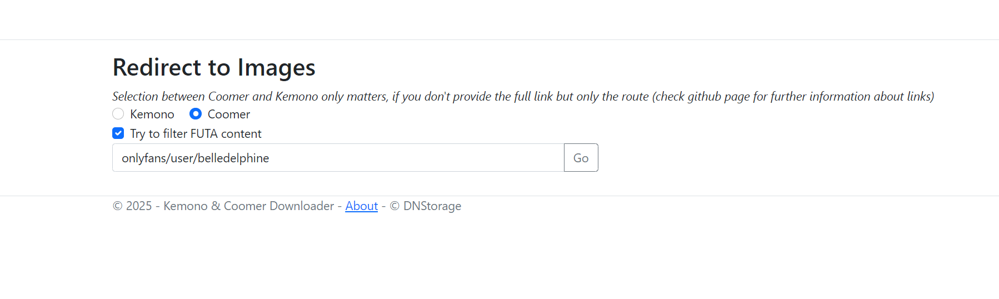
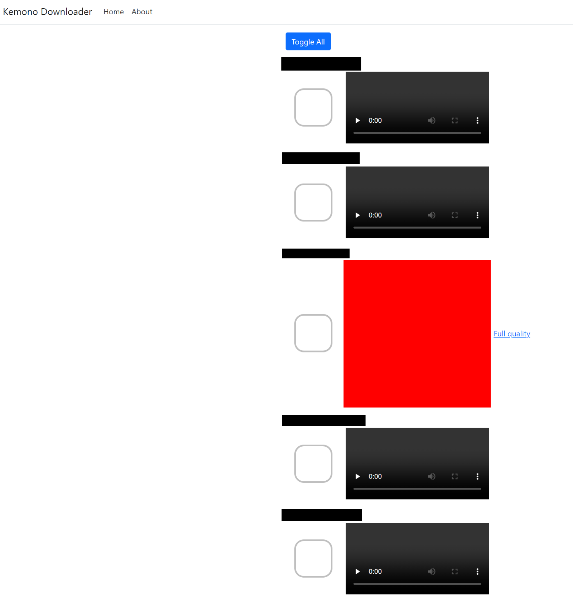

## Welcome to KEMONO.SU and COOMER.SU web based downloader

The application is written in ASP.NET, and can be ran on any machine with .NET installed. This application allows you to see every attachment on artist's page and then select whatever attachment you want and then download it as a ZIP file. The paging in the application work the same way as the KEMONO.SU one, meaning on the page one in the application you have the same posts as on the page one of artist's site on Kemono/Coomer.

To operate the application you will need .NET 8.0 ([link](https://dotnet.microsoft.com/en-us/download/dotnet/8.0)). On **Windows** all you have to do is run the KEMONO-DOWNLOADER.exe application.
on **Linux** you need to navigate to the program's folder using a terminal and run the command below

    dotnet KEMONO-DOWNLOADER.dll
Command above also works on a windows machine, but its simpler to just run the executable.

When you open the website written in the Console app/Terminal you should be greeted by this sight

Here you can see two inputs, a checkbox, that if checked, will try to filter any FUTA related post, but its far from perfect, because it only checks if the string "futa" is present in the name of the post (Case Insensitive). Then you can see a text input, that can either be in a format (http://,https://)kemono.su/*xxx*/user/*xxx* or just the route of the author's page eg. /patreon/user/xxx or patreon/user/xxx. At the backend the application will always try to extract just the route.

Also above the checkbox "Try to filter FUTA content" you can see 2 radio buttons, specifying if you are trying to get artist from Kemono or Coomer. These radio buttons are only relevant when you input only the route of the URL, same as the last two examples below. If the application detect either kemono.su or coomer.su in the URL, it will automatically detect the website you are trying to download from.

Working example inputs

> https://kemono.su/patreon/user/32764584

> http://kemono.su/patreon/user/32764584

> kemono.su/patreon/user/32764584

> /patreon/user/32764584

> patreon/user/32764584

When you paste a author's kemono/coomer page and you click go, you should be seeing something similar to this

Here you can see the name of the attachment, a check box, which determins, whether or not you want to download said attachment, the attachment itself and if the attachment is an Image, also a link called "Full quality". For speed and performace reasons, this application doesn't fetch full images, but only thumbnails, which are drastically smaller in size and thus speeding up the loading process, but down worry, if you decide to download the image by checking the checkmark, it will download the full resolution version. When you go to the bottom of the page, you can see paging, which corelates to the paging on kemono/coomer, meaning that on page 1 there will be all attachments that are present on the author's page on kemono.su/coomer.su. Also there is the button to download all selected attachments at the bottom of the page.

If you would like to develop some features yourself, its written in C# .NET 8.0/ASP.NET 8.0
